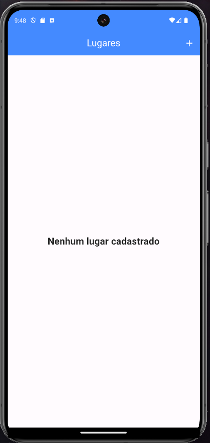
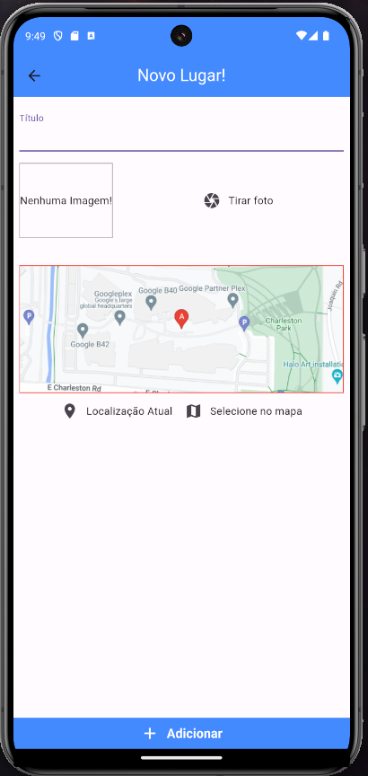
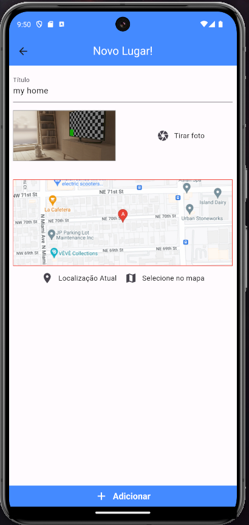
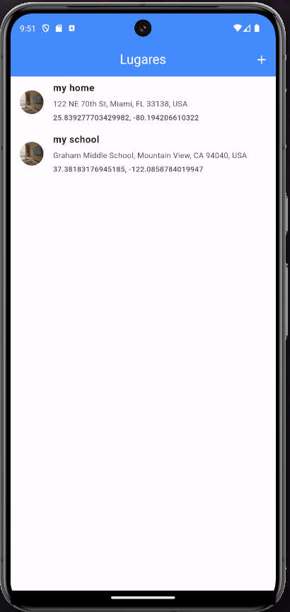

# Greate Places Flutter App

## Before all
- Take a photos and get real location.
- using Google Maps API.
- **[WARNING]** Add Google Maps Key in [google_api.dart](lib/constants/google_api.dart).
- **[WARNING]** Add Google Maps Key inside [AndroidManifest.xml](android/app/src/main/AndroidManifest.xml) located in line 10 <YOUR KEY HERE>.

# Preview
- Forked from [Shop Flutter App](https://github.com/gabrielnavas/shop_flutter_auth_firebase_app) and enhanced with animations.
- Utilizes a state manager and enables data persistence on Firebase.

 

## Screens

### Places list empty 

### Add new place without data

### Add new place

### Some places

